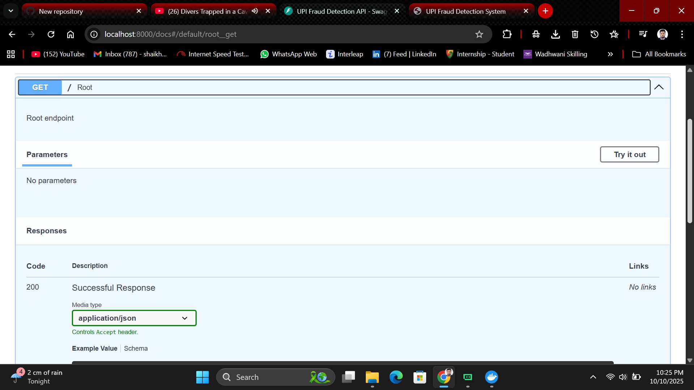
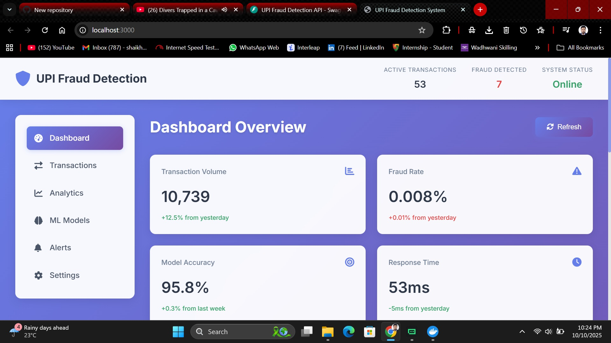
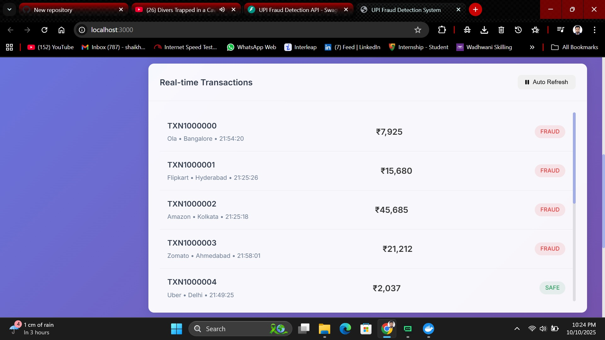
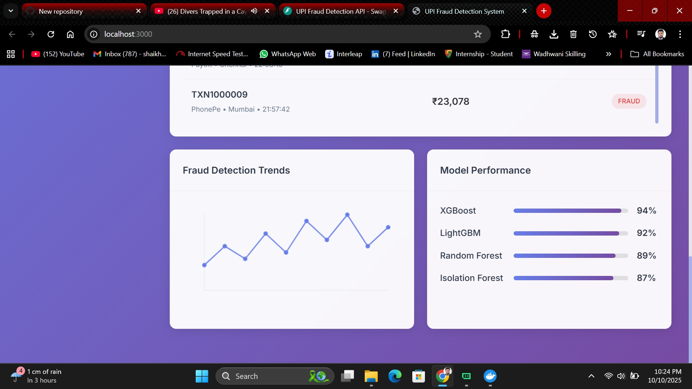

# UPI Fraud Detection Using Random Forest

This project demonstrates a machine learning approach to UPI fraud detection using a Random Forest classifier. It analyzes transaction details such as bank book name, transaction ID, and amount to classify each transaction as either successful or failed due to incorrect details.

## Abstract

With the rapid adoption of Unified Payments Interface (UPI) for digital transactions, the risk of fraudulent activities has increased significantly. This project proposes a Random Forest-based approach to verify UPI transaction details. By analyzing inputs like bank book name, transaction ID, and transaction amount, the system classifies each attempt as either:

- Transaction Failed: Incorrect Details Entered
- Transaction Successful: Details Verified and Processed

The model is designed to be accurate, robust against overfitting, and suitable for real-world digital payment environments.

**Keywords**: UPI Digital Payments, Random Forest Algorithm, Machine Learning

## Existing System (KNN)

K-Nearest Neighbors (KNN) is a simple, non-parametric algorithm used for classification and regression. It predicts outcomes by comparing a query point to its nearest neighbors. While intuitive and easy to implement, KNN becomes slow on large datasets and is sensitive to irrelevant or noisy features.

### Disadvantages

- Slow on large datasets due to distance computations
- Sensitive to noisy or irrelevant features
- Struggles with high-dimensional data

## Proposed System (Random Forest)

Random Forest builds multiple decision trees and combines their outputs to improve accuracy and reduce overfitting. For UPI fraud detection, it captures subtle patterns from transaction attributes and adapts well to evolving fraud tactics. Feature importance scores also provide insight into which details most influence the decision.

### Advantages

- Works well for classification and regression tasks
- Handles large, high-dimensional datasets
- Reduces overfitting by aggregating multiple trees

### Applications

- Banking: loan and transaction risk analysis
- Medicine: disease trend and risk identification
- Land Use: identifying similar land patterns
- Marketing: customer segmentation and trend analysis
- Crop Prediction

## System Specifications

### Hardware

- Processor: Intel i5 (or equivalent)
- RAM: 8 GB minimum
- Storage: 128 GB minimum

### Software

- OS: Windows 10
- Python: 3.6+
- IDE: PyCharm or Jupyter Notebook
- Libraries: numpy, pandas, scikit-learn, flask/fastapi

## Implementation Outline

### System

1. Create Dataset
    - Generate synthetic records with bank book name, transaction ID, amount, and outcome
    - Split into training (70%) and testing (30%) sets
2. Pre-processing
    - Handle missing values
    - Normalize numerical values and encode categorical fields
3. Training
    - Train the Random Forest classifier
    - Tune hyperparameters for best performance
4. Classification
    - Predict outcomes on new user input
    - Report success or failure with confidence

### User

1. Upload Transaction Details
    - Enter bank book name, transaction ID, and amount
    - Validate inputs before submission
2. View Results
    - Display success or failure outcome
    - Optionally show confidence or feature importance

## Repository

GitHub: [https://github.com/vamsikiran1234/Upi_Fraud_Detection](https://github.com/vamsikiran1234/Upi_Fraud_Detection)

## Features

- **Random Forest Classifier**: Robust, accurate, and resistant to overfitting
- **Transaction Detail Verification**: Bank book name, transaction ID, amount
- **Clear Outcomes**: 
    - Transaction Failed: Incorrect Details Entered
    - Transaction Successful: Details Verified and Processed
- **Simple Web UI**: Quick validation for demo and review

## Technologies Used

- **Machine Learning**: scikit-learn, pandas, numpy
- **API Framework**: FastAPI (demo backend)
- **Frontend**: HTML, CSS, JavaScript

## Getting Started

### Prerequisites

- Python 3.8+
- pip package manager
- Virtual environment (recommended)

### Installation

1. Clone the repository
```bash
git clone https://github.com/yourusername/upi-fraud-detection.git
cd upi-fraud-detection
```

2. Create and activate a virtual environment (optional but recommended)
```bash
python -m venv .venv
# On Windows
.venv\Scripts\activate
# On Unix or MacOS
source .venv/bin/activate
```

3. Install dependencies
```bash
pip install -r requirements-fixed.txt
```

### Running the System

#### Basic Mode (Backend API)

Run the demo API:
```bash
python simple_backend_api.py
```

#### Frontend Dashboard

Start the frontend UI:
```bash
cd frontend
python server.py
```

## System Workflow

1. **Create Dataset**: Build or simulate transaction records
2. **Pre-processing**: Handle missing values and encode features
3. **Training**: Train the Random Forest classifier
4. **Classification**: Predict outcome for new transactions

## Advantages

- Performs well on noisy, real-world data
- Handles high-dimensional features effectively
- Reduces overfitting by combining multiple trees

## Contributing

Contributions are welcome! Please feel free to submit a Pull Request.

## Structure

The project directory is organised as follows:

```
├── advanced_quick_start.py     # Advanced system startup
├── quick_start.py              # Basic system startup
├── frontend/                   # Frontend web interface
│   ├── server.py               # Frontend server
│   ├── index.html              # Main HTML page
│   ├── script.js               # Frontend JavaScript
│   └── styles.css              # CSS styles
├── dashboard/                  # React dashboard
│   ├── src/                    # React source code
│   └── public/                 # Public assets
├── models/                     # ML model files
│   ├── gnn/                    # Graph Neural Network models
│   ├── tabular/                # Tabular data models
│   └── sequence/               # Sequence models
├── serving/                    # Model serving components
│   └── models/                 # Model implementations
├── data/                       # Data storage
├── config/                     # Configuration files
├── docs/                       # Documentation
├── tests/                      # Test files
└── infra/                      # Infrastructure code
    └── k8s/                    # Kubernetes configurations
```

## Screenshots

### API Documentation


### API Endpoints


### Dashboard Overview


### Real-time Transactions


### Fraud Detection Trends


## License

This project is licensed under the MIT License - see the [LICENSE](LICENSE) file for details.

## Author

© 2026 Vamsi Kiran

---

Give this repository a ⭐ if you like it.
