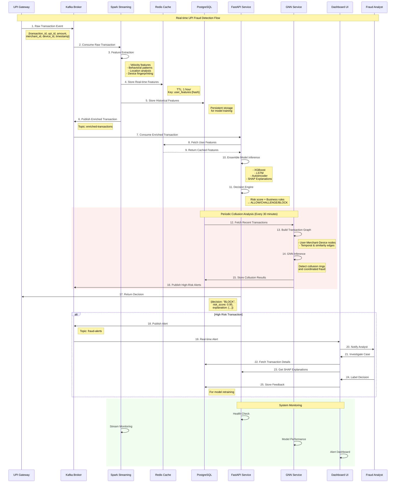
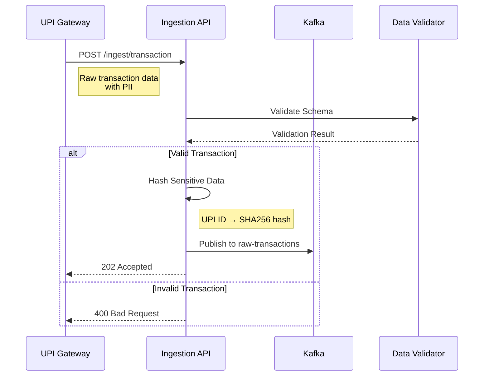
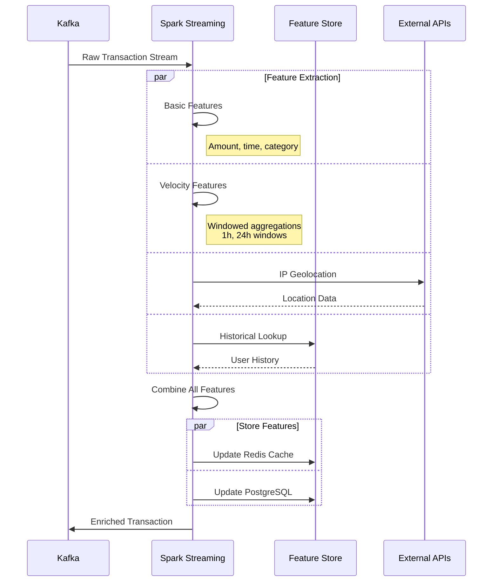
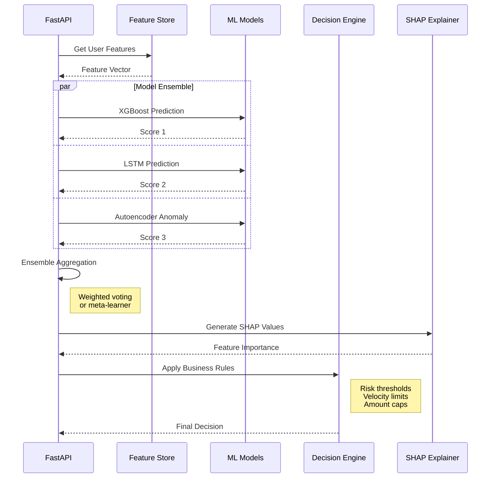
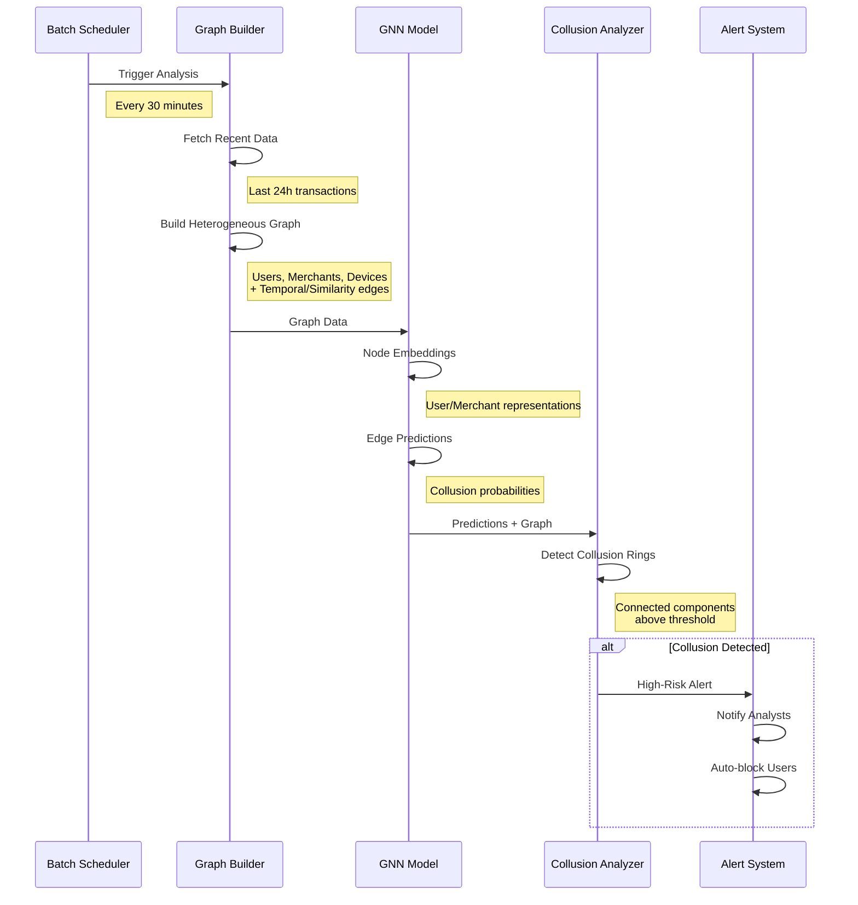
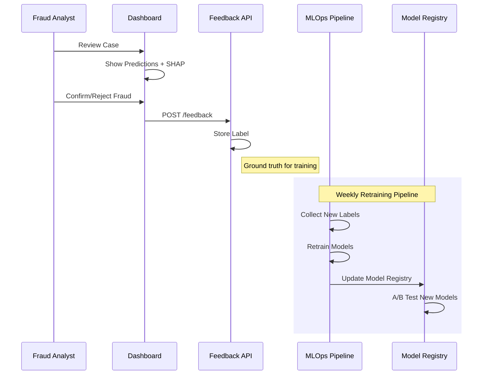

# UPI Fraud Detection System - Data Flow Sequence Diagram

## Complete End-to-End Data Flow



## Detailed Component Interactions

### 1. Transaction Ingestion Flow



### 2. Feature Engineering Pipeline



### 3. Real-time Inference Pipeline



### 4. Graph Neural Network Collusion Detection



### 5. Feedback Loop & Model Updates



## Data Flow Summary

### High-Level Architecture
```
UPI Gateway → Kafka → Spark Streaming → Feature Store → FastAPI → Decision
                ↓                           ↓              ↓
            Enriched Data              Real-time Cache   SHAP Explanations
                ↓                           ↓              ↓
            GNN Analysis ←─────────── Historical Store → Feedback Loop
                ↓
        Collusion Alerts
```

### Key Data Transformations

1. **Raw Transaction** → **Hashed & Validated**
   ```json
   {
     "upi_id": "user123@paytm" → "a1b2c3d4e5f6...",
     "amount": 5000,
     "timestamp": "2024-01-15T10:30:00Z"
   }
   ```

2. **Basic Features** → **Enriched Features**
   ```json
   {
     "amount": 5000,
     "hour": 10,
     "user_txn_count_1h": 3,
     "user_amount_sum_24h": 15000,
     "velocity_risk": 0.2,
     "location_change": 0.05
   }
   ```

3. **Model Predictions** → **Business Decision**
   ```json
   {
     "risk_score": 0.85,
     "fraud_probability": 0.78,
     "decision": "CHALLENGE",
     "explanation": {
       "top_features": ["high_velocity", "new_device"],
       "shap_values": [0.3, 0.25, ...]
     }
   }
   ```

### Performance Characteristics

- **Ingestion Latency**: < 10ms
- **Feature Engineering**: < 50ms  
- **Model Inference**: < 100ms
- **End-to-End Latency**: < 200ms
- **Throughput**: 10,000+ TPS
- **GNN Analysis**: 30-minute batch cycles

### Scalability Points

1. **Horizontal Scaling**
   - Kafka partitions for parallel processing
   - Spark worker nodes for feature engineering
   - FastAPI replicas for inference load

2. **Caching Strategy**
   - Redis for hot user features (1-hour TTL)
   - PostgreSQL for historical analysis
   - Model caching for faster inference

3. **Monitoring & Alerting**
   - Real-time metrics via Prometheus
   - Grafana dashboards for visualization
   - PagerDuty integration for critical alerts
